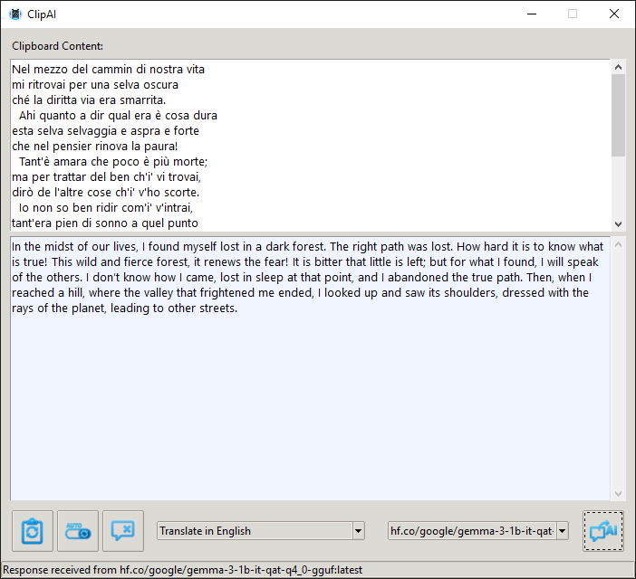

# ClipAI


ClipAI is a clipboard viewer and transformer application built using Tkinter. It allows users to view the current clipboard content, clear it, and send it to a language model for transformations such as rephrasing or translating into English.

## Screenshot



## Features

- View current clipboard content
- Clear clipboard content
- Auto-refresh clipboard content
- Send clipboard content to a language model for transformations
- Select different transformation types (e.g., rephrase, translate)
- Choose from available language models

## Dependencies

- Python 3.x
- Tkinter
- pyperclip
- requests
- Ollama

## Installation

1. Clone the repository:
   ```sh
   git clone https://github.com/markod0925/ClipAI.git
   cd ClipAI
   ```

2. Make an environment and install the required dependencies:
   ```sh
   python -m venv clipAIenv
   .\clipAIenv\Scripts\activate
   pip install -r requirements.txt
   ```

3. Install Ollama:
   Follow the instructions on the [Ollama website](https://ollama.com) to install the Ollama API.

## Usage

1. Run the application:
   ```sh
   python ClipAI.py
   ```

2. The main window will display the current clipboard content. You can use the buttons to refresh, clear, or send the content to a language model.

3. Select the desired transformation type and model from the dropdown menus before sending the content.

## UI Customization and Themes

ClipAI uses the 'clam' theme for a modern look. You can customize the UI by modifying the theme settings in the `ClipAI.py` file. The application uses the `ttk.Style` class to apply the theme and style the widgets. You can refer to the [Tkinter documentation](https://docs.python.org/3/library/tkinter.ttk.html#styling) for more information on how to customize the appearance of the widgets.

## Adding New Prompts

The `TRANSFORMATION_PROMPTS` dictionary in the `ClipAI.py` file is used to store the different transformation prompts that can be applied to the clipboard content. Each key in the dictionary represents a transformation type, and the corresponding value is the prompt template.

### Step-by-Step Guide to Add New Prompts

1. Open the `ClipAI.py` file in your preferred code editor.
2. Locate the `TRANSFORMATION_PROMPTS` dictionary.
3. Add a new key-value pair to the dictionary, where the key is the name of the new transformation type, and the value is the prompt template.

### Example

To add a new prompt for summarizing text, you can modify the `TRANSFORMATION_PROMPTS` dictionary as follows:

```python
TRANSFORMATION_PROMPTS = {
    "Rephrase": "Please rephrase the following text while keeping the original meaning: \"{}\"",
    "Translate in English": "Please translate the following text into English: \"{}\"",
    "Summarize": "Please summarize the following text: \"{}\""
}
```

After adding the new prompt, you can select "Summarize" from the dropdown menu in the application to apply the summarization transformation to the clipboard content.
